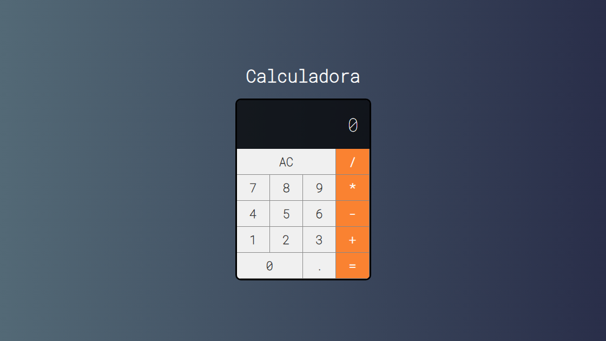

<h2 id="sobre-o-projeto">1. Calculadora Pro: Engenharia Reativa com React ⚛️</h2>

Bem-vindo(a) ao **Universo React**! Este projeto é uma calculadora avançada desenvolvida com **Create React App (CRA)**. Mais do que apenas cálculos, esta aplicação explora conceitos fundamentais da biblioteca, como gerenciamento de estados complexos, hooks de otimização e uma interface moderna e resiliente a erros.

---

## 📚 Tabela de Conteúdo

| ⚛️ O Projeto | 🛠️ Técnico | 🤝 Comunidade |
| :---: | :---: | :---: |
|  |  |  |
|  |  |  |
|  |  |  |
|  |  |  |

---

<h2 id="tecnologias-utilizadas">2. ⚙️ Tecnologias Utilizadas</h2>

| Camada | Tecnologia | Descrição |
| :--- | :--- | :--- |
| **Framework** |  | Biblioteca base para construção da UI. |
| **Estado** | `useState` | Gerenciamento dinâmico dos valores do display. |
| **Performance** | `useCallback` | Otimização de funções para evitar renderizações desnecessárias. |
| **Ambiente** | `Create React App` | Ferramenta de configuração e build otimizado. |

---

<h2 id="como-acessar">3. 🚀 Como Acessar</h2>

Experimente a calculadora em tempo real clicando no botão abaixo:

  

---

<h2 id="funcionalidades">4. 🧩 Funcionalidades Principais</h2>

| Funcionalidade | Descrição |
| :--- | :--- |
| ➕ **Operações Aritméticas** | Soma, subtração, multiplicação e divisão precisas. |
| ⚡ **Hot-Reloading** | Desenvolvimento ágil com atualizações instantâneas. |
| 🧹 **Clear Display** | Limpeza completa do estado da calculadora. |
| 🛑 **Tratamento de Erros** | Exibição visual de "Erro" para operações matemáticas inválidas. |
| 🧪 **Test-Ready** | Estrutura preparada para testes com Jest e RTL. |

---

<h2 id="destaques-tecnicos">5. 💻 Destaques Técnicos</h2>

A engenharia deste projeto foca na robustez e performance:

### 📐 Otimização com useCallback
Diferente de calculadoras simples, aqui as funções de clique são memorizadas para garantir que a aplicação mantenha 60 FPS mesmo em interações rápidas, evitando *re-renders* de componentes pesados.

### 🔄 Fluxo de Estado Único
O gerenciamento centralizado do estado permite uma transição fluida entre números e operadores, tratando o encadeamento de operações complexas de forma lógica.

---

<h2 id="scripts-disponiveis">6. 📂 Scripts Disponíveis</h2>

No diretório do projeto, você pode executar:

* **`npm start`**: Inicia o servidor em .
* **`npm test`**: Executa os testes unitários.
* **`npm run build`**: Gera a versão de produção na pasta `build`.
* **`npm run eject`**: Permite controle total das configurações (irreversível).

---

<h2 id="como-contribuir">7. 🤝 Como Contribuir</h2>

Siga os passos abaixo para fortalecer este projeto:

| Fase | Ação | Link / Comando |
| :---: | :--- | :--- |
| **01** | **Fork** |  |
| **02** | **Branch** | `git checkout -b feature/MinhaMelhoria` |
| **03** | **Commit** | `git commit -m 'feat: melhoria na validação de ano'` |
| **04** | **Push** | `git push origin feature/MinhaMelhoria` |
| **05** | **PR** | 

### 🐛 Encontrou um problema?
Se algo não estiver funcionando como esperado, não hesite em abrir um chamado:

---

<h2 id="faq">8. 🧠 Perguntas Frequentes</h2>

<strong>Como lidar com variáveis de ambiente ❓</strong>

🔑 <strong>Resposta:</strong> Crie um arquivo <code>.env</code> na raiz e adicione variáveis começando com <code>REACT_APP_</code> para que o React as reconheça.

<strong>A calculadora aceita casas decimais ❓</strong>

🔢 <strong>Resposta:</strong> Sim, o estado trata a entrada de pontos decimais e realiza os cálculos utilizando o motor matemático do JavaScript.

---

<h2 id="codigo-fonte">9. 💻 Código Fonte</h2>

Analise a estrutura de componentes e hooks:

---

<h2 id="créditos">10. 📝 Créditos & Reconhecimentos</h2>

A Calculadora React é um marco no estudo de interfaces modernas:

| Atribuição | Responsável / Recurso | Descrição |
| :--- | :--- | :--- |
| **Dev React** | **DomisDev** | Implementação de lógica, estados e otimização. |
| **Build Tool** | **Meta / CRA** | Ferramentas de infraestrutura e bundling. |
| **Apoio Técnico** | **Google Gemini** | Padronização King-Domfy e refinamento documental. |

---

<h2 id="licenca">11. 📄 Licença</h2>

Este projeto está sob a 

---

<h2 id="perfil-do-github">12. 👨‍💻 Perfil do GitHub</h2>

